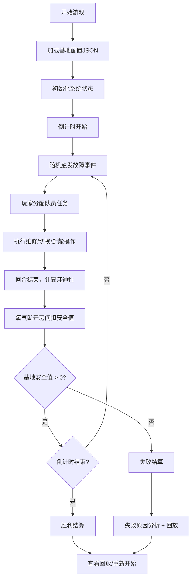

## 1. 产品概述

太空基地合作解谜网页游戏，玩家需要在倒计时内管理队员维修故障系统，维持基地正常运转。游戏模拟真实的太空站生命维持系统，通过连通性计算、资源管理和策略决策带来紧张刺激的合作解谜体验。

- 核心玩法：回合制策略解谜，玩家分配队员执行维修、切换电路、封舱门等操作
- 目标用户：喜欢策略解谜、合作游戏的玩家
- 市场价值：填补浏览器端太空生存策略游戏的空白，提供深度玩法和可重玩性

## 2. 核心功能

### 2.1 用户角色
| 角色 | 注册方式 | 核心权限 |
|------|----------|----------|
| 玩家 | 无需注册，直接进入 | 完整游戏体验、存档、回放 |

### 2.2 功能模块
1. **游戏主界面**：基地剖面图、队员状态、系统状态、倒计时
2. **队员管理**：队员列表、技能展示、任务分配
3. **事件系统**：随机故障生成、事件日志、警报提示
4. **连通性计算**：氧气/电力网络分析、房间安全值计算
5. **回放系统**：失败原因分析、操作历史回放

### 2.3 页面详情
| 页面名称 | 模块名称 | 功能描述 |
|----------|----------|----------|
| 开始页面 | 开始界面 | 游戏标题、开始按钮、规则说明、难度选择 |
| 游戏主页面 | 基地剖面 | 可视化展示基地模块、管线状态、氧气/电力流通情况 |
| 游戏主页面 | 队员面板 | 显示队员状态、技能、当前任务、可分配操作 |
| 游戏主页面 | 控制面板 | 维修管线、切换电路、封舱门等操作按钮 |
| 游戏主页面 | 事件日志 | 实时记录故障发生、维修进度、系统状态变化 |
| 游戏主页面 | 状态栏 | 倒计时、整体安全值、氧气/电力系统状态 |
| 结算页面 | 结果展示 | 显示胜利/失败、得分统计、失败原因分析 |
| 结算页面 | 回放功能 | 操作时间轴、逐步回放、关键节点标注 |

## 3. 核心流程

游戏开始 → 初始化基地状态（JSON）→ 倒计时开始 → 随机故障事件触发 → 玩家分配队员执行任务 → 回合结束计算连通性 → 氧气断开房间扣安全值 → 重复直到胜利/失败 → 结算与回放

## 4. 用户界面设计

### 4.1 设计风格
- **工业科幻风格**：深色背景配合荧光色高亮，模拟太空站控制台
- **主色调**：深蓝 #0a1628（背景）、深灰 #1a2a3a（面板）
- **强调色**：青色 #00d4ff（氧气正常）、黄色 #ffcc00（警告）、红色 #ff4444（危险）、绿色 #00ff88（电力正常）
- **按钮风格**：方形带发光边框，按下有凹陷效果，禁用状态为灰色
- **字体**：等宽字体 'JetBrains Mono' 显示数据，'Orbitron' 显示标题
- **布局**：网格布局，左侧基地剖面图，右侧控制面板和日志，底部状态栏
- **图标风格**：线性简约图标，带发光效果
- **特殊效果**：扫描线纹理、故障闪烁动画、数据流动画

### 4.2 页面设计概述
| 页面名称 | 模块名称 | UI 元素 |
|----------|----------|----------|
| 开始页面 | 开始界面 | 大标题发光动画、扫描线背景、金属质感按钮、规则说明卡片 |
| 游戏主页面 | 基地剖面 | SVG剖面图，房间块用不同颜色表示状态，管线用动画线条，队员图标可拖拽 |
| 游戏主页面 | 队员面板 | 卡片式布局，头像、技能条、状态徽章、任务进度环 |
| 游戏主页面 | 控制面板 | 分组按钮，操作确认弹窗，资源消耗提示 |
| 游戏主页面 | 事件日志 | 终端风格滚动列表，时间戳，不同事件颜色区分，新消息高亮 |
| 游戏主页面 | 状态栏 | 倒计时数字跳动动画，进度条带发光效果，系统状态指示灯 |
| 结算页面 | 结果展示 | 大标题动画，数据统计卡片，失败原因树状图 |
| 结算页面 | 回放功能 | 时间轴滑块，播放控制按钮，关键事件标记点 |

### 4.3 响应性
- 桌面端优先设计，1280px 以上最佳体验
- 平板端自适应，面板可折叠
- 移动端简化布局，重点保留基地视图和核心操作

### 4.4 视觉动效
- 页面加载：元素从边缘滑入， staggered 延迟
- 故障发生：红色闪烁警报，屏幕震动效果
- 维修完成：绿色粒子扩散动画
- 氧气流动：青色流光沿管线移动
- 电力流通：绿色脉冲效果
- 倒计时：最后10秒数字变红并放大
- 队员移动：平滑过渡动画，轨迹线显示
