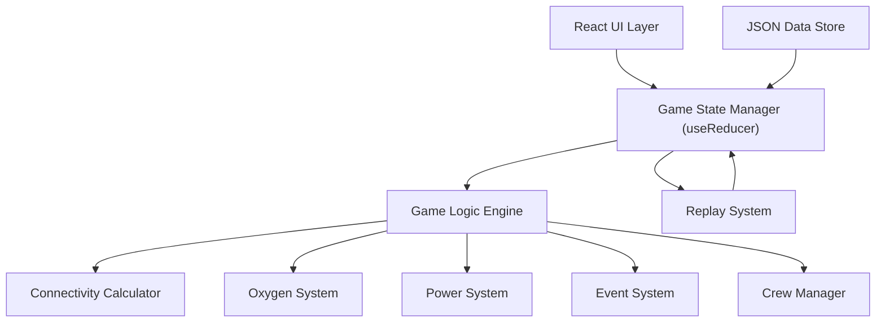

## 1. 架构设计

纯前端单页应用，使用 React 状态管理游戏状态，JSON 存储基地配置和游戏存档。



## 2. 技术描述

- **Frontend**: React@18 + TypeScript + Vite
- **Styling**: TailwindCSS@3 + CSS Variables + 自定义动画
- **State Management**: React useReducer + Context
- **Visualization**: SVG + CSS Animations
- **Data Storage**: LocalStorage + JSON files
- **No Backend**: 纯前端实现，所有逻辑在客户端运行

## 3. 目录结构

```
src/
├── components/          # React 组件
│   ├── game/           # 游戏主界面组件
│   │   ├── BaseSection.tsx      # 基地剖面图
│   │   ├── CrewPanel.tsx        # 队员面板
│   │   ├── ControlPanel.tsx     # 控制面板
│   │   ├── EventLog.tsx         # 事件日志
│   │   └── StatusBar.tsx        # 状态栏
│   ├── StartScreen.tsx # 开始页面
│   └── ResultScreen.tsx # 结算页面
├── game/               # 游戏核心逻辑
│   ├── types.ts        # TypeScript 类型定义
│   ├── state.ts        # 状态管理和reducer
│   ├── config.ts       # 基地配置JSON
│   ├── connectivity.ts # 连通性计算
│   ├── oxygen.ts       # 氧气系统
│   ├── power.ts        # 电力系统
│   ├── events.ts       # 事件系统
│   └── replay.ts       # 回放系统
├── hooks/              # 自定义Hooks
│   ├── useGame.ts
│   └── useCountdown.ts
├── utils/              # 工具函数
├── App.tsx
├── main.tsx
└── index.css
```

## 4. 路由定义

| 路由 | 用途 |
|------|------|
| / | 开始页面 |
| /game | 游戏主页面 |
| /result | 结算页面 |

## 5. 数据模型

### 5.1 数据模型定义

```mermaid
erDiagram
    BASE ||--o{ MODULE : contains
    BASE ||--o{ PIPE : contains
    BASE ||--o{ CREW : contains
    BASE ||--o{ EVENT : has
    MODULE ||--o{ DOOR : has
    MODULE ||--o{ CIRCUIT : has
    PIPE ||--o MODULE : connects
    CREW ||--o TASK : performs
```

### 5.2 类型定义

```typescript
// 基地模块（房间）
interface Module {
  id: string;
  name: string;
  type: 'command' | 'living' | 'lab' | 'storage' | 'engine' | 'airlock';
  position: { x: number; y: number; width: number; height: number };
  oxygenLevel: number;      // 0-100
  safetyLevel: number;      // 0-100
  hasPower: boolean;
  isSealed: boolean;
  connectedTo: string[];    // 连接的模块ID
}

// 管线（氧气/电力）
interface Pipe {
  id: string;
  type: 'oxygen' | 'power';
  from: string;             // 起点模块ID
  to: string;               // 终点模块ID
  status: 'normal' | 'damaged' | 'broken';
  damageLevel: number;      // 0-100
  path: { x: number; y: number }[];
}

// 舱门
interface Door {
  id: string;
  between: [string, string]; // 两个模块ID
  isOpen: boolean;
  isSealed: boolean;
  position: { x: number; y: number };
}

// 电路
interface Circuit {
  id: string;
  name: string;
  moduleId: string;
  isOn: boolean;
  priority: number;
}

// 队员
interface Crew {
  id: string;
  name: string;
  avatar: string;
  skills: {
    repair: number;        // 维修技能 0-100
    electrical: number;    // 电气技能 0-100
    engineering: number;   // 工程技能 0-100
  };
  health: number;          // 0-100
  currentModule: string;   // 当前所在模块ID
  currentTask: Task | null;
  status: 'idle' | 'moving' | 'working' | 'resting';
}

// 任务
interface Task {
  id: string;
  type: 'repair_pipe' | 'seal_door' | 'switch_circuit' | 'move';
  targetId: string;
  assignedCrewId: string;
  progress: number;        // 0-100
  duration: number;        // 需要的时间（回合数）
  startTime: number;
}

// 事件
interface GameEvent {
  id: string;
  type: 'pipe_damage' | 'power_failure' | 'oxygen_leak' | 'fire' | 'system_repaired';
  timestamp: number;
  turn: number;
  message: string;
  severity: 'info' | 'warning' | 'danger' | 'success';
  targetId?: string;
}

// 游戏状态
interface GameState {
  turn: number;
  timeRemaining: number;    // 剩余时间（秒）
  overallSafety: number;    // 整体安全值 0-100
  base: {
    modules: Module[];
    pipes: Pipe[];
    doors: Door[];
    circuits: Circuit[];
  };
  crew: Crew[];
  events: GameEvent[];
  activeTasks: Task[];
  status: 'playing' | 'victory' | 'defeat';
  defeatReason?: string;
  history: HistoryFrame[];  // 用于回放
}

// 回放心帧
interface HistoryFrame {
  turn: number;
  timestamp: number;
  stateSnapshot: Partial<GameState>;
  actions: Action[];
}

// 玩家操作
interface Action {
  type: 'assign_task' | 'seal_door' | 'switch_circuit' | 'end_turn';
  payload: any;
  timestamp: number;
}
```

### 5.3 核心配置 JSON 示例

```json
{
  "modules": [
    {
      "id": "cmd",
      "name": "指挥中心",
      "type": "command",
      "position": { "x": 400, "y": 50, "width": 150, "height": 100 },
      "oxygenLevel": 100,
      "safetyLevel": 100,
      "hasPower": true,
      "isSealed": false,
      "connectedTo": ["living", "lab"]
    }
  ],
  "pipes": [
    {
      "id": "pipe1",
      "type": "oxygen",
      "from": "cmd",
      "to": "living",
      "status": "normal",
      "damageLevel": 0,
      "path": [{ "x": 475, "y": 150 }, { "x": 475, "y": 200 }, { "x": 200, "y": 200 }]
    }
  ]
}
```

## 6. 核心算法

### 6.1 连通性计算算法
- 使用 BFS/DFS 遍历氧气/电力网络
- 从氧气发生器/主电源出发，遍历所有正常的管线
- 标记可达的模块为有氧气/电力
- 断开或损坏的管线作为图的割边处理

### 6.2 维修速度计算
```
维修速度 = 基础速度 × (1 + 技能值 / 100) × 损坏程度修正
实际回合数 = ceil(基础回合数 / 维修速度)
```

### 6.3 安全值衰减
- 每个无氧气的模块每回合损失 `10 + 随机(0-5)` 安全值
- 模块安全值降到 0 时，整体安全值扣除 `15 + 模块权重`
- 整体安全值降到 0 则游戏失败

## 7. 回放系统设计

- 每回合结束时记录状态快照和玩家操作
- 保存完整的 `HistoryFrame` 数组到 LocalStorage
- 回放时逐帧恢复状态，高亮关键事件
- 支持播放/暂停/快进/跳转功能
- 失败时自动分析关键决策点，标注失败原因
